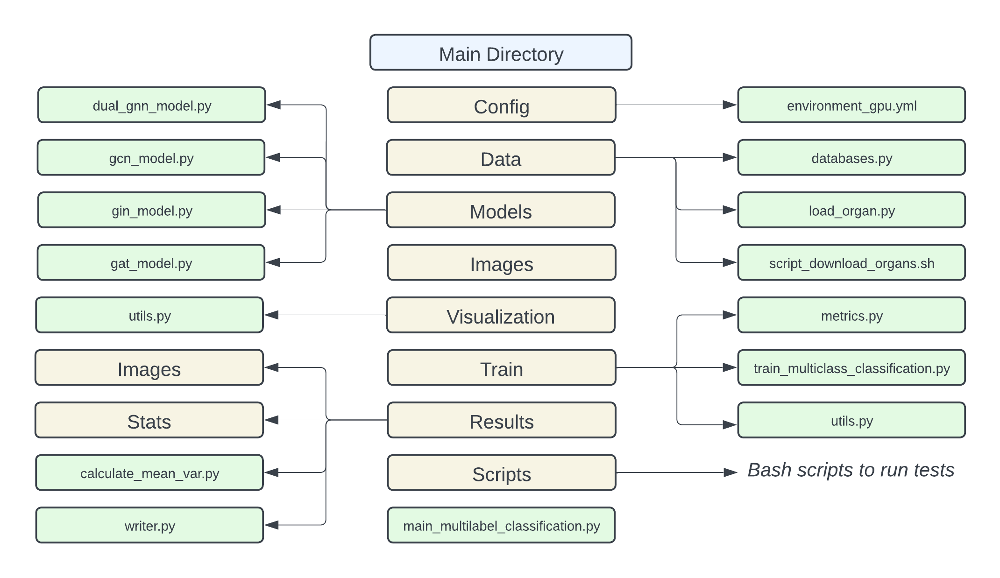

# DuoGNN: Topology-aware Graph Neural Network with Homophily and Heterophily Interaction-Decoupling
This repository is part of a workshop paper published in MICCAI ([GRAIL 2024](https://grail-miccai.github.io)). It contains the main source code for our proposed topological-aware architecture with interaction-decoupling stage and a GNN benchmark implementing well-known baselines such as GCN, GIN, and GAT. Additionally, the [data](./data/) directory has a data generator script to convert the medical image datasets MedMNIST Organ-C and Organ-S into graphs. Follows an overview of the structure of the repository:




<br>


## 1. Benchmark installation

Follow these instructions to install the benchmark and set up the environment.

### 1.1 Setup Conda

To manage Python environments and packages effectively, first install Conda. This tool helps in creating isolated environments and managing dependencies.

#### For Linux
```bash
# Download and install Miniconda (a minimal Conda installer) for Linux
curl -o ~/miniconda.sh -O https://repo.continuum.io/miniconda/Miniconda3-latest-Linux-x86_64.sh
chmod +x ~/miniconda.sh    
./miniconda.sh  
source ~/.bashrc
```

#### For macOS
```bash
# Download and install Miniconda for macOS
curl -o ~/miniconda.sh -O https://repo.continuum.io/miniconda/Miniconda3-latest-MacOSX-x86_64.sh
chmod +x ~/miniconda.sh    
./miniconda.sh  
source ~/.bash_profile
```

### 1.2 Setup Python environment

To utilize GPU acceleration, CUDA is required. This section installs CUDA 10.2 and sets up the Python environment for GPU-based computations. Ensure that the CUDA version is compatible with your hardware and other installed libraries.

For Ubuntu **22.04** - Only if CUDA 10.2 is not already installed

```bash
# Remove old CUDA and NVIDIA packages to avoid conflicts
sudo apt-get --purge remove "*cublas*" "cuda*" "nvidia*"
sudo apt autoremove

# Download and install CUDA 10.2 for Ubuntu 22.04
wget https://developer.download.nvidia.com/compute/cuda/repos/ubuntu2204/x86_64/cuda-repo-ubuntu2204_10.2.89-1_amd64.deb
sudo dpkg -i cuda-repo-ubuntu2204_10.2.89-1_amd64.deb
sudo apt-key adv --fetch-keys http://developer.download.nvidia.com/compute/cuda/repos/ubuntu2204/x86_64/7fa2af80.pub
sudo apt update
sudo apt install -y cuda-10-2

# Reboot to apply CUDA changes
sudo reboot

# Verify CUDA installation
cat /usr/local/cuda/version.txt  # Check CUDA version is 10.2
```

After installing CUDA, you will set up the Python environment and install additional dependencies.

```bash
# Clone the GitHub repository containing the benchmark code
conda install git
git clone https://github.com/basiralab/DuoGNN.git
cd DuoGNN

# Create and install the Python environment for GPU
conda env create -f config/environment_gpu.yml 

# Activate the GPU environment
conda activate benchmark_gnn_gpu

# Install additional Python packages needed for GPU support
pip install torch-sparse==0.6.7+cu102 --no-index --upgrade --no-cache-dir --use-deprecated=legacy-resolver -f https://data.pyg.org/whl/torch-1.6.0.html
pip install torch-scatter==2.0.5+cu102 --no-index --upgrade --no-cache-dir --use-deprecated=legacy-resolver -f https://data.pyg.org/whl/torch-1.6.0.html
```

**Note:** The versions of CUDA and PyTorch packages should be compatible with each other. Adjust versions if necessary based on compatibility with your system.


<br>

## 2. Download datasets

Download the datasets needed for benchmarking and training. The datasets are automatically handled by `pytorch-geometric` for Planetoid datasets, while the medical datasets require a script to convert image data into graph formats.

Proceed as follows to download the benchmark datasets.


### 2.1 Organ-S & Organ-C datasets

The `load_organ.py` script is used to load MedMNIST Organ-S and Organ-C and convert the datasets into graph representations. The script creates graphs with nodes representing images and edges representing similarities between images. The generated graphs have two types of density, providing different perspectives on the data.

```bash
# Navigate to the data directory and execute the script to download and convert datasets
cd data/
bash script_download_organs.sh
```

This script creates new folders for the graph datasets and executes the python file [load_organ.py](../data/load_organ.py). 


### 2.2 Planetoid datasets (Cora, CiteSeer, PubMed)

These datasets are managed automatically by `pytorch-geometric`. Ensure the dependencies are correctly installed for automatic dataset handling.

<br>

## 3. Reproducibility 

To ensure that results can be replicated, follow these instructions for running experiments and reproducing the published results.

### 3.1 Run in Terminal Using Main Script

Use the main script to train and evaluate models. Adjust the parameters based on your experimental setup.

```bash
# Example commands to run the main file at the root of the project

python main_multilabel_classification.py --dataset_name Cora --batch_norm --do_eval --print_result --model_type GCN --num_epoch 300 --hidden_channels 2048

python main_multilabel_classification.py --dataset_name Organ-C --batch_norm --do_eval --print_result --model_type GAT --num_epoch 300 --hidden_channels 256 --remove_edges 5000 --topological_measure random

python main_multilabel_classification.py --dataset_name Organ-S --batch_norm --do_eval --print_result  --model_type DualGCN --num_epoch 300 --remove_edges 5000 --max_communities 500 --hidden_channels 1024 --topological_measure curvature
```


### 3.2 Run in Terminal Using Script

For quicker tests, you can use the provided script file. Alternatively, modify this script or create new ones as needed.

```bash
# Navigate to the main directory and execute a test script
bash scripts/run_light_test.sh
```

Review [`run_light_test.sh`](../scripts/run_light_test.sh) to understand the script’s setup and adjust it according to your needs.

### 3.3 Output Results

Model performance results are saved in `results/stats` with filenames like `result_DATASET.csv`. To compute statistics from multiple runs, use the provided script.

```bash
# Calculate mean and variance over multiple runs
cd results
python calculate_mean_var.py stats/LOG_FILENAME.csv
```

Additionally, while running experiments, heterophily and homophily distribution shifts will be saved in `results/images`.

## 4 Bugs

### 4.1 GraphRicciCurvature: KeyError: 'formanCurvature'

If you are using an older version of the `GraphRicciCurvature` library, you might encounter a `KeyError` when calculating the curvature of graphs with connected components. This issue has been addressed in more recent versions of the library. You can resolve it by either updating to the latest version of the library or by manually applying the following code modifications:

```python
# Source: benchmark_gnn_{DEVICE}/lib/python{VERSION}/site-packages/GraphRicciCurvature/FormanRicci.py

# Node Forman curvature
        for n in self.G.nodes():
            fcsum = 0  # sum of the neighbor Forman curvature
            if self.G.degree(n) != 0:
                for nbr in self.G.neighbors(n):
                    if 'formanCurvature' in self.G[n][nbr]:
                        fcsum += self.G[n][nbr]['formanCurvature']

                # assign the node Forman curvature to be the average of node's adjacency edges
                self.G.nodes[n]['formanCurvature'] = fcsum / self.G.degree(n)
            # TODO: Add the following two lines
            else:
                self.G.nodes[n]['formanCurvature'] = fcsum

            logger.debug("node %d, Forman Curvature = %f" % (n, self.G.nodes[n]['formanCurvature']))
```

<br>

## 5. Reference 
Please cite the following paper when using DuoGNN:

[https://arxiv.org/abs/2409.19616](https://arxiv.org/abs/2409.19616)

<br><br><br>

